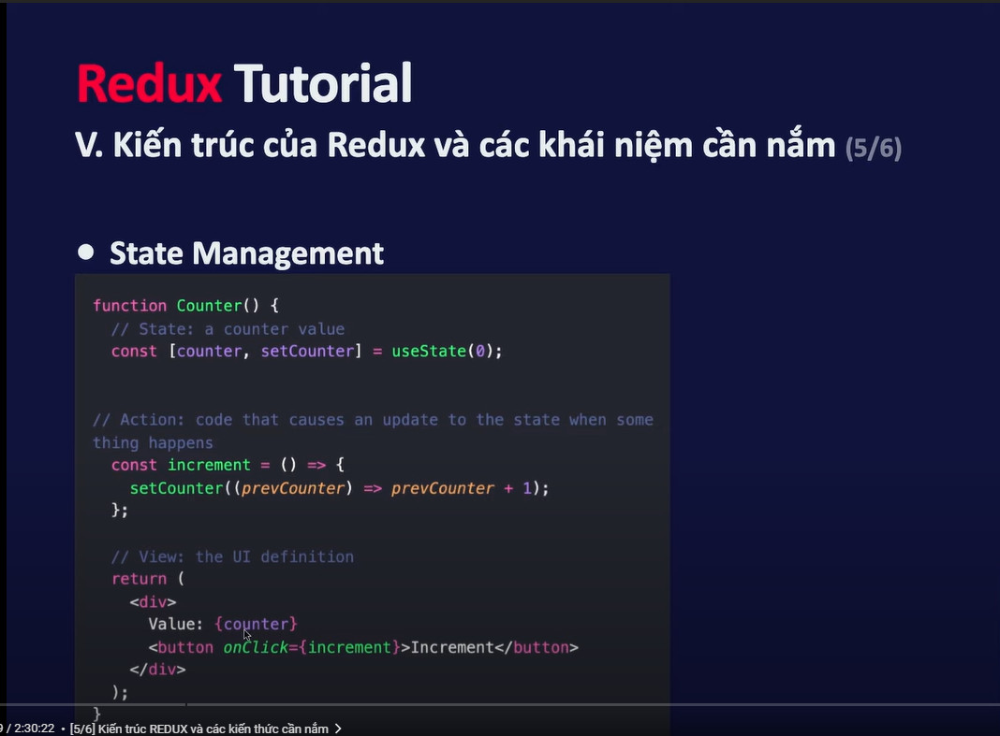
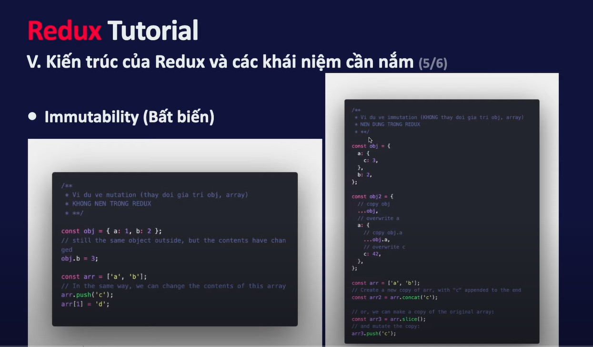

# Redux

### Redux là gì?

1. Redux là một PATTERN (Khuôn mẫu)

- Là một thư viện dùng để quản lý và cập nhật state của ứng dụng (State ở đây là trạng thái, dữ liệu ở trong ứng dụng). redux sử dụng những sự kiện (được gọi là các actions) nó hoạt động như một kho lưu trữ tập chung cho các state được sử dụng ở component và nhiều nơi khác nhau trong ứng dụng

2. Tại sao phải sử dụng Redux

- Giúp quản lý các global state
- Mọi nơi có thể truy xuất và cập nhật
- Giải quyết vấn đề của redux khi truyễn dữ liệu xuống các cấp con cháu, hoặc các component không có sự liên kết

3. Dễ dàng debug

- Redux hướng chúng ta tới viết code một cách pridictation (Có thể dự toán) và có thể testable(Có thể test)

4. Xử lý catching dữ liệu từ phía server
5. Vì sao phải sử dụng redux toolkit

- Redux Toolkit cũng là một thư viện JS và nó sẽ bọc bên ngoài của redux core và nó sẽ chứa các package, function cần thiết khi chúng ta
- Redux Toolkit sinh ra để giải quyết các vấn đề với redux core
  - Việc cấu hình với redux phức tạp
  - Phải cài đặt thủ công nhiều packages để Redux có thể hoạt động hiệu quả
  - Redux yêu cầu rất nhiều boilerplate code (Code lặp đi lặp lại rất nhiều lần)

6. Khi nào khi sử dụng redux

- Dự án có số lượng lớn state, và các state được cập nhật ở nhiều nơi
- State được cập nhật thường xuyên
- Logic code cập nhật state rất phức tạp (Call api và cập nhật state khi có phản hồi từ server)
- Ứng dụng có số lượng lớn code trung bình hoặc lớn và có nhiều người làm chung
- Cần debug và xem cách state cập nhật ở bất kì khoảng thời gian nào

=> Không phải lúc nào cũng sử dụng Redux (Không nên sử dụng redux cho đến khi gặp vấn đề khi sử dụng redux thuần)

7. Kiến trúc của Redux

- State managment: là khái niệm chung trong một ứng dụng Frontend, quản lý các trạng thái, dữ liệu trong ứng dụng của chúng ta
  

- React hoạt động theo mô hình một chiều (one way data flow): Từ dữ liệu trong State => Nó render ra view => Khi thực hiện một hành động => Nó cập nhật lại State => State được cập nhật thì nó lại cập nhật lại view...


8. Immutability (Bất biến)
   

- Không nên thay đổi State trong redux một cách trực tiếp, nó có thể gây ra một số bug như:
  - UI, phía giao diện không thể cập nhật chính xác theo dữ liệu mới nhất
  - Không hiểu tại sao, bằng cách nào một state được cập nhật
  - Viết test khó
  - Phá vỡ khả năng time travel debug, quy tắc của redux

9. Kiến trúc của redux


- Reducers: Là một function nhận vào hai tham số (state, action): function này được sử dụng để cập nhật lại giá trị state ở trong kho chung
  - state có một giá trị khởi tạo
  - Không được thay đổi trực tiếp giá trị state mà phải tạo ra một phiên bản coppy của nó
  - Không được có một đoạn code bất đồng bộ nào ở trong reducer
  - Không được sử dụng các hàm tạo giá trị ngẫu nhiên như `Math.random()`, `Date.now()` (1)
  - Không sử dụng các hành động Side Effect - VD thực hiện request tới server (Sau đó nhận dữ liệu trả về từ server - những dữ liệu này ta không thể đoán trước được) (2)
  - Hành động (1) và (2) không nên sử dụng trong redux vì nó tạo ra các giá trị ngẫu nhiên ta không thể đoán trước được hoặc ta không biết dữ liệu trả về từ server là gì, vì thế nó vi phạm quy tắc predictable của redux
  - Side Effect là những thứ không thể đoán trước được bởi vì nó được thực hiện bởi thế giới bên ngoài
  - Một function tuân theo những quy tắc trên được gọi là pure function
- Action: Đơn giản là một object, nó nên có 2 fields là type và payload (Có thể có hoặc không)
  - Action creators (function tạo ra action): Lợi ích của nó là không phải tạo ra các action object nhiều lần và hạn chế hard code

```js
const increamentCreator = (data) => {
  return {
    type: "todoList/increament",
    payload: data,
  };
};
```

- Dispatch: Là một function: Giúp cập nhật state thông qua function dispatch, nó nhận vào một action object (Từ phía UI khi thực hiện một điều gì đó nó sẽ bắn đi một action object với dữ liệu mà ta mô tả trong object này => Nó đi vào reducer và thực hiện cập nhật)

### Thực hành với redux core

- Để sử dụng redux core cần down 2 package là `react-redux` và `redux`
- Để xem được dữ liệu trên dev-tools cần cài đặt `npm i redux-devtools-extension`
- Lưu ý khi sử dụng useSelector, mỗi lần sử dụng dữ liệu trong redux thì ta lại phải sử dụng: `const data = useSelector(state => state.todoList)`
  => Làm như này sẽ lặp code rất nhiều khi ta muốn sử dụng cùng một dữ liệu tại nhiều component khác nhau, thì thao tác trên bị lặp lại nhiều lần => Giải pháp ở đây là tạo một hàm để dùng chung như sau:

```js
export const todoListSelector = (state) => {
  const todoRemaining = state.todoList.filter((todo) => {
    return todo.name.toLowerCase().includes(state.filters.search.toLowerCase());
  });
  return todoRemaining;
};
export const searchSelector = (state) => state.filters.search;
```

- Tuy nhiên khi code kiểu như trên thì ta thấy dòng `state.filters.search` xuất hiện nhiều lần, điều này là không nên khi sử dụng trong dự án của chúng ta vì khi muốn sửa đổi thì phải sửa ở rất nhiều nơi, vì thế ta sử dụng một cái được gọi là reselect (Thư viện này có sẵn trong redux toolkit, tuy nhiên mình đang làm ví dụ về redux core nên cần cài đặt nó theo cú pháp `npm i reselect`)

=> Code lúc này trở thành như sau:

- createSelector chứa các tham số là các selector phụ thuộc, cuối cùng là một callback nhận vào giá trị trả về của các phụ thuộc.

```js
import { createSelector } from "reselect";

export const todoListSelector = (state) => state.todoList;
export const searchSelector = (state) => state.filters.search;

export const todoRemainingSelector = createSelector(
  todoListSelector,
  searchSelector,
  (todoList, searchTextSelector) => {
    return todoList.filter((todo) => {
      return todo.name.toLowerCase().includes(searchTextSelector.toLowerCase());
    });
  }
);

// HOẶC
export const todoRemainingSelector = createSelector(
  todoListSelector,
  searchSelector,
  filterStatusSelector,
  priorityStatusSelector,
  (todoList, searchTextSelector, status, priorities) => {
    return todoList.filter((todo) => {
      let statusFilter = "All";
      if (status === "Completed") {
        statusFilter = true;
      }
      if (status === "Todo") {
        statusFilter = false;
      }
      const prioriryFilter =
        priorities.length > 0 ? priorities.includes(todo.prioriry) : true;
      const isMatch =
        todo.name.toLowerCase().includes(searchTextSelector.toLowerCase()) &&
        (statusFilter === "All" ? true : todo.completed === statusFilter) &&
        prioriryFilter;
      return isMatch;
    });
  }
);
```

### REDUX TOOLKIT

- Cải tiến của redux toolkit
- Cú pháp cài đặt: `npm install @reduxjs/toolkit`

- Giải thích đoạn code sau:

```js
const filtersSlice = createSlice({
  name: "filters",
  initialState,
  reducers: {
    searchFilterChange: (state, ation) => {},
    statusFilterChange: (state, ation) => {},
    priorityFilterChange: (state, ation) => {},
  },
});
```

- Mỗi một field trong reducer nó sẽ tự động tạo ra một action creator
  VD:

```js
function searchFilterChange() {
  return {
    type: "filter/searchFilterChange", // Chuỗi này được tạo ra theo quy luật `name/fieldName` => Vì thế cần chỉ định cho mỗi slice một name
  };
}
```

=> Chúng ta không cần phải tạo ra thêm một actions nữa mà thằng redux toolkit sẽ tự động tạo ra cho chúng ta một action phụ thuộc vào name và field

- Ta nhớ rằng, trong redux-core thì trong mỗi reducer nó sẽ phải return một state mới để cập nhật state hiện tại, đặc biệt state này không được chỉnh sửa trực tiếp, tuy nhiên đối với redux-toolkit thì chúng ta có thể chỉnh sửa theo kiểu mutable(Thao tác trực tiếp trên một state mà không cần phải clone), bản chất là bên dưới redux-toolkit vẫn phải tạo ra một state mới thôi, nhưng nó cho phép chúng ta viết như kiểu imutable (Thực tế nó không chạy như thế) bởi vì nó sử dụng một thư viện được gọi là Immer
- Lưu ý: Trong một reducer sử dụng redux toolkit chúng ta có thể sử dụng 100% kiểu mutable nha
